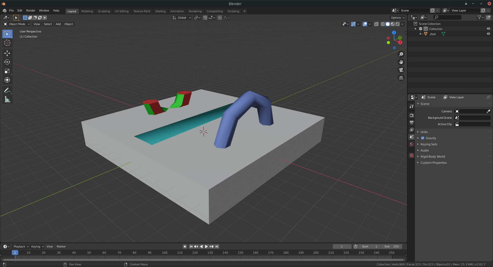

# Godot CSG Exporter
Godot editor plugin to export CSG Meshes as Wavefront (.obj) files.

For now the plugin is only able to export the raw mesh, not any materials appended to it.

## How to install
Add the addon on your Godot project (you may copy the addon from this project folder, or install it via AssetLib). Then activate it on the project settings "Plugins" tab.

## How to use it
Whenever you click on a root CSGMesh, the addon will add a "Export CSG" button to the Spatial Editor upper bar. This will open a File Dialog popup so you can choose where to save the exported file.

## Why using it
CSG Meshes are quite useful to prototyping and making quick modifications on levels, but sometimes you may want to export the mesh made in Godot so it can be edited in other software (e.g. Blender)
